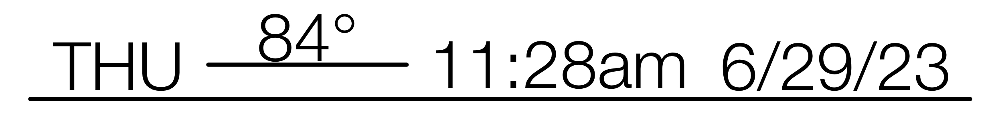

# 📑 Field Logs

My field logs are anything I find I want to solidify as a memory or useful/meaningful experiences. Other reasons may be therapeutic. Studies show writing in a journal can be helpful for the mind to process.

Any experience I have I will document if I feel it will:

- Provide a memory I want to visit in the future
- A potential learning experience
- A brief update/mention that is relevant to research or a project I am conducting
- Something that will resonate within or release from my thoughts so to attempt to make me a better person

The image below is a template for documenting, from left to right, the day, temperature, time, and date for every entry you make into the daily log. I write this from right to left so that it is neat every time.

**Example:**

